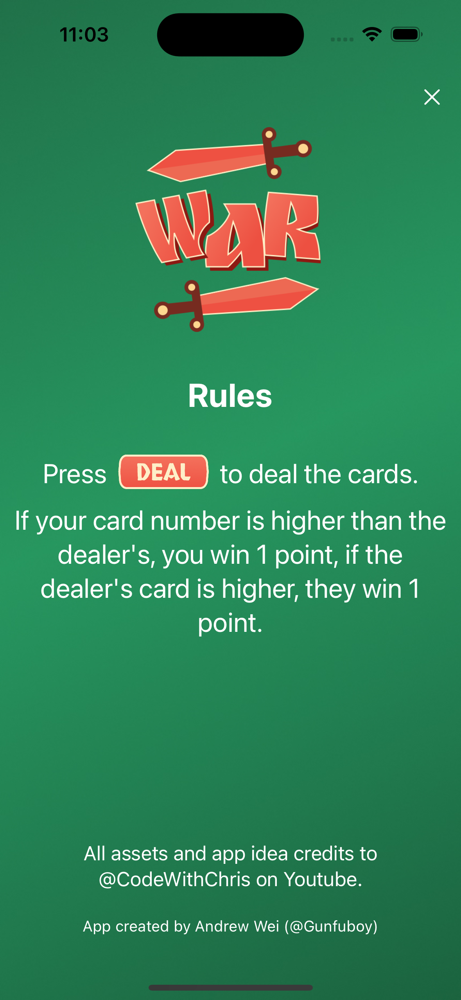

# A War Card Game App 
A simple War card game app on IOS. 

The rule of the game is simple: you win when you draw a card that is higher than your opponent (the Dealer).

    

## About
The application contains three main components: 

1. The Deal button, which shows two cards on screen, one for dealer and one for the player. If the player's card is of higher value than the dealer's, the player gets 1 point, and vice versa.

    

2. The About page, showing the game rule and some acknowledgements.

    

3. The Background button, which changes the main page's background between four preset.

    
    
    

## Requirements
Because the app has not been deployed to the App Store nor Test Flight, simply clone the repository into your favorite Swift-supported code editor. 
The program has been created using XCode, and tested using its internal simulator.

## Quickstart
To test the functionality of the apps:

1. Open XCode
2. Create a new folder and clone repo
3. Run with builder and interact with the simulator

## Acknowledgement
App idea and assets are credits to @CodeWithChris on YouTube.
